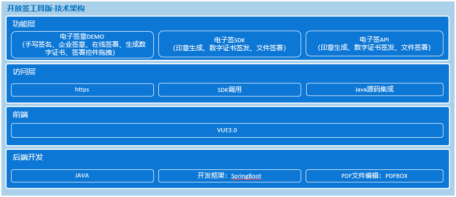
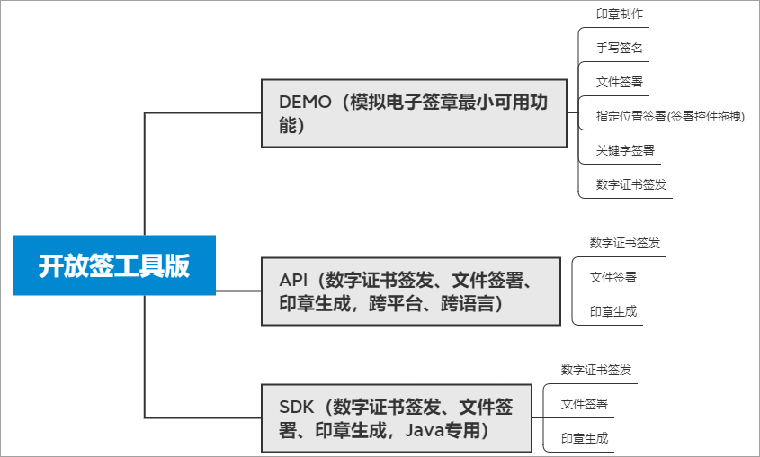

# 开放签电子签章/电子合同系统-工具版
## 一、项目介绍
开放签电子签章系统开源工具版旨在将电子签章、电子合同系统开发中的前后端核心技术开源开放，适合有技术能力的个人/团队学习或自建电子签章\电子合同功能或应用，避免研发同仁在工作过程中重复造轮子，降低电子签章技术研发要求，让电子签章相关的技术可以更低门槛的应用在各个业务系统中。

**特别提醒：开放签工具版签发的数字证书包括测试数字证书和CA正式数字证书，其中测试数字证书只能应用于技术测试环境，且应用测试数字证书签署的任何电子文件均不具备法律效力，如需签发权威CA机构的数字证书，请与我们联系，获取商业授权token。**
## 二、技术架构
### 1、技术架构
开放签工具版采用前后端分离架构开发，前端采用VUE3、后端采用Java开发语言和spring boot架构。详细的技术架构如下图所示：

### 2、开发语言与组件
前端开发：VUE3；
后端开发：JDK版本：1.8+；
PDF文件处理：pdfbox；
### 3、代码模块
```
kaifangqian-base--------------开放签工具版源码
├─docs------------------------文档相关
├─kaifangqian-api-------------开放签工具版API接口源码
├─kaifangqian-demo-api--------开放签工具版demo后端api源码
├─kaifangqian-demo-web--------开放签工具版demo前端源码
└─kaifangqian-sdk-------------开放签工具版SDK源码
```
## 三、功能模块 
### 1、功能模块结构

###
### 2、功能模块说明
#### API接口（跨平台、跨语言便于任何语言的开发者使用）：
提供企业印章制作、证书签发、文件签署（指定位置签署、关键字签署）API接口服务。 API接口采用HTTP（S）通讯，JSON报文格式，具有跨平台、跨语言特性，专为各类开发语言用户提供服务，便于其他语言的开发者快速集成和应用电子签名；
#### demo（以最小可用的方式应用电子签章\电子合同）：
（1）前端：主要实现在线签署、手写签名、电子印章生成、拖动位置签署等可视化的操作体验；

（2）后端：使用API接口或SDK为前端提供服务。
#### SDK（便于Java开发者快速应用电子签章）：
SDK能力同API接口，便于使用java语言开发的用户直接集成使用。
## 四、功能介绍
### 4.1 API接口
#### [开放签API接口文档](./docs/kaifangqian-doc.pdf)

#### [开放签API安装部署](./kaifangqian-api/README.md)

### 4.2 SDK

#### [SDK集成](./kaifangqian-sdk/README.md)

### 4.3 demo

#### 1、 整体功能页面展示


#### 2、手写签名面板：提供个人手写签名面板的前端页面，生成手写签名图片。


#### 3、电子印章制作：为企业生成电子印章，生成印章的方式有两种。

#### （1）系统生成：根据印章环绕文字、横排文字生成电子印章图片。


#### （2）印模生成：1.在白纸上加盖印章；2.扫描上传进行自动透明化抠图；3.生成透明印章。


#### 4、数字证书生成：用于电子签章的数字证书（测试证书，正式环境下或真实场景使用数字证书，需自己采购或用我们采购的数字证书替换），该数字证书使用公钥加密技术进行生成，主要用于帮助开发者跑通电子签章流程。【非CA机构签发，不具备法律效力！】


#### 5、PDF文件转图片：提供PDF文件转图片的工具类。

电子签章过程中存在着在网页上对签署文件进行预览、指定签署位置、文件签署等操作，由于图片在浏览器上的兼容性和友好性优于PDF文件，所以一般在网页上进行电子签章时，会先将PDF文件转换成图片，展示给用户。用户在页面上确定好签署位置，并进行签署时，后端服务会通过对电子印章/手写签名位置、大小以及PDF文件的大小进行计算，在PDF文件的准确位置上完成文件签署。

#### 6、电子文件签署：提供两种电子签署的方式。

（1）关键字签署：指定PDF文件中需要进行签章的关键字。签署时，在文档中查找对应关键字的位置，并加盖电子印章/手写签名，完成电子签章；

（2）指定位置签署：直接在PDF文件中拖动需要加盖电子印章/手写签名的位置。签署时，直接在指定位置上完成电子签章。

## 
## 六、相关链接
### 官方网站

开放签官网：[https://www.kaifangqian.com](https://www.kaifangqian.com)
### 开源工具版
（1）开放签电子签章系统-开源工具版体验地址：[https://demo.kaifangqian.com](https://demo.kaifangqian.com)

（2）开放签电子签章系统-开源工具版gitee源码：[https://gitee.com/kaifangqian/kaifangqian-base](https://gitee.com/kaifangqian/kaifangqian-base)

（3）开放签电子签章系统-开源工具版github源码：[https://github.com/kaifangqian/kaifangqian-base](https://github.com/kaifangqian/kaifangqian-base)
### 企业版
#### 简介
开放签企业版支持私有化部署、多租户、SaaS化等多种服务模式，提供文件在线签署、文档模板管理、签约业务线管理、企业印章管理、CA数字证书管理等服务，满足电子合同、电子保单、电子报告单、招投标文件、电子成绩单、电子证明、金融凭证、会计凭证、电子处方等多种电子文件签署场景。
#### 体验地址
（1）企业版体验地址：[https://home.kaifangqian.com/#/login](https://home.kaifangqian.com/#/login)

（2）企业版使用手册：[https://www.yuque.com/huxin-ch41t/kaifangqian](https://www.yuque.com/huxin-ch41t/kaifangqian)
## 七、反馈交流
QQ交流群：482074553
联系电话：150-1099-3257
