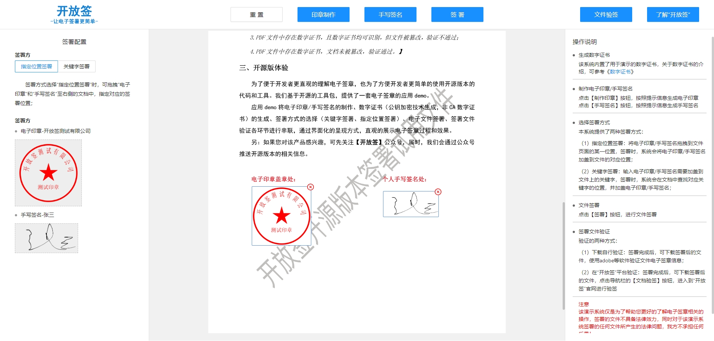

<h1 style="text-align: center">open-sign-vue 开放签工具前端源码</h1>

#### 项目简介
将电子签章的核心技术代码和工具进行开源，开源版采用更加宽松的MIT开源协议，且不受商业限制。产品功能包括：电子印章制作，手写签名生成，数字证书生成，PDF文件转图片，电子签章（关键字签署、指定位置签署），文件验签等


#### 项目源码
|     |   后端源码  |   前端源码  |
|---  |--- | --- |
|  github   |  https://github.com/kaifangqian/open-sign   |  https://github.com/kaifangqian/open-sign-vue  |
|  码云   |  https://gitee.com/kaifangqian/open-sign   |  https://gitee.com/kaifangqian/open-sign-vue  |

#### 官网地址
[https://www.kaifangqian.com](https://www.kaifangqian.com)

#### 体验地址
[https://demo.kaifangqian.com](https://demo.kaifangqian.com)

#### demo截图




#### Build Setup
**推荐 node 版本：v16.x**
``` bash
#进入项目目录
cd open-sign-vue

# 安装依赖
npm install -registry=https://registry.npm.taobao.org

# 启动前需要将后端服务启动,否则无法体验签署功能
# 并修改vite.config.js中的代理地址
# 启动服务 localhost:8080
npm run dev

# 构建生产环境
npm run build
```


#### 反馈交流

- QQ交流群：482074553
