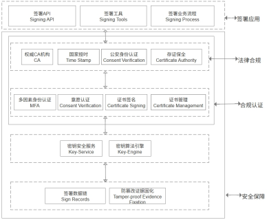

# 开放签电子合同系统

## 项目简介
开放签是一个电子合同签署平台，提供合同创建、签署、管理及验证等完整解决方案。系统支持个人与企业实名认证、电子印章管理、合同模板配置、签署流程控制等功能，适用于各类需要电子签约的业务场景。

## 产品功能结构
开放签从不同的用户视角将平台拆分为3个用户端和1个api接口套件：
- **签约业务端**:个人和企业用户在业务端进行电子签约业务处理；
- **企业管理端**:企业管理员对企业组织、印章、证书及应用权限进行管理；
- **平台运营端**:平台运营方对平台内账号、证书、实名认证信息、安全配置等进行管理；
- **API接口**:供相关业务系统、办公系统等与开放签电子签章系统功能无缝对接集成，确保业务流程的高效协同。

## 核心功能
- **文件在线签发**:支持 Web、H5、API 多端签署各类文件（如电子合同、标书、货运单、证明、审批文件等），满足多种签署需求。
- **企业印章管理**:支持印章全生命周期管理（新增、编辑、停用、销毁等），支持三权分立机制：管理权、使用权、审计权。
- **企业组织及权限管理**:支持平台多租户、企业组织架构、成员、角色及权限管理。
- **业务线管理**:业务线是一种电子文件签署的业务流程，通过对业务线配置可构建电子合同、电子保单、招投标文件、电子成绩单、电子证明、金融凭证、会计凭证、电子处方等多种电子文件签署场景，具备灵活规范、操作合规、风险可控、效率提升等特点.
- **自定义签署文档模板**:提供在线模板功能，签署过程可使用模板完成多方填写和确认。
- **安全合规认证**:符合电子签名法律法规，结合国密算法加密、签名，确保签署流程可追溯、防篡改。通过公安部门实名认证锁定身份，权威 CA 机构颁发数字证书确保法律效力，全过程操作日志归档保全。

# 技术架构
开放签采用现代化前后端分离架构，构建了一个安全、合规、可扩展的电子签平台。整体设计兼顾技术透明性与司法可信度，支持私有化部署、多租户服务和标准化 API 接入，满足企业级应用场景需求。
架构设计遵循模块化、高内聚低耦合原则，便于二次开发、功能扩展及集成对接。
- **前端框架**:Vue 3 + Vite
- **后端语言**:Java（JDK 1.8+）
- **后端框架**:Spring Boot + Spring Security + MyBatis Plus
- **文件处理**:Apache PDFBox 实现 PDF 文档操作
- **数据库**:MySQL / PostgreSQL（支持国产数据库适配）
- **部署方式**:支持 Docker 容器化部署
- **接口规范**:RESTful API + Swagger UI 文档
- **日志系统**:Logback + ELK 可视化日志分析
- **权限控制**:RBAC 模型 + JWT 认证机制

## 系统架构图

## 代码结构

# 功能截图

# 系统部署
推荐linux系统，服务器配置4核八G
- 原生部署：（下载源码，自行打包）https://docs.kaifangqian.com/docs/deploy/native
- docker部署：（镜像文件请找官网客服）https://docs.kaifangqian.com/docs/deploy/docker 
 **部署完成后，如需使用认证的CA数字证书签署，请联系客户获取云盾服务授权码。** 

# 相关地址
- **产品门户网站**:www.kaifangqian.com
- **云服务体验地址**:home.kaifangqian.com
- **产品参考文档**:docs.kaifangqian.com
- **接口文档**:https://docs.kaifangqian.com/docs/api/quick-start

## 加入社群

# 许可证
本项目遵循AGPL 3.0协议。详见[LICENSE](LICENSE)文件。