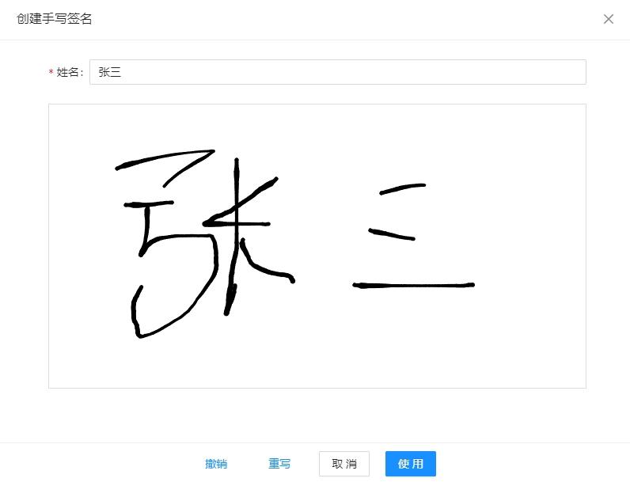
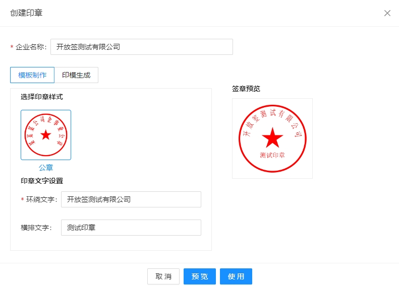
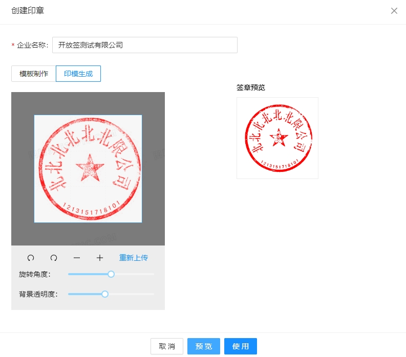
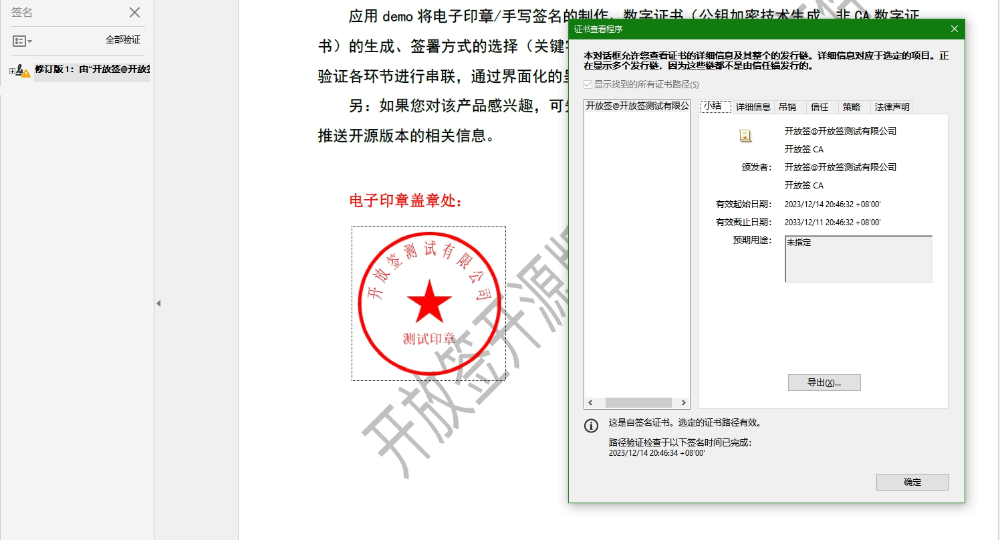
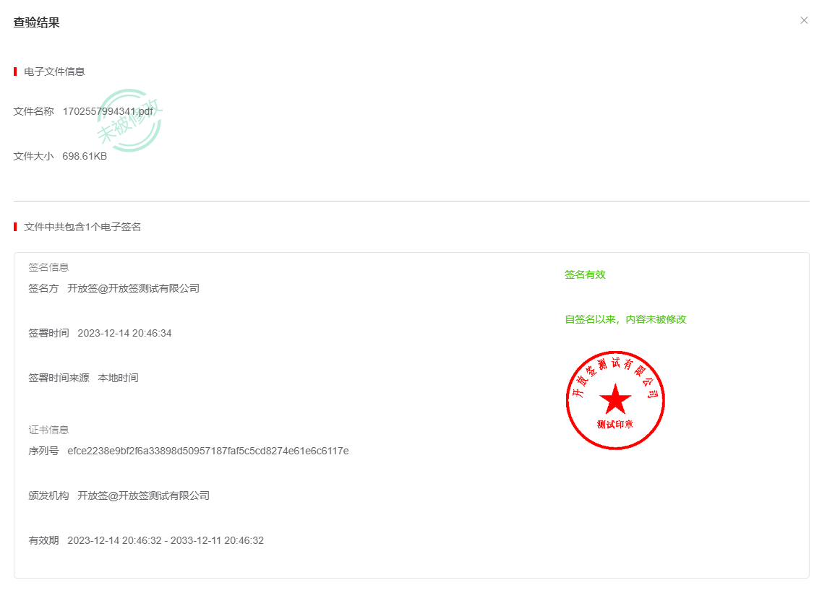

<h1 style="text-align: center">开放签电子签章工具版前端源码</h1>

#### 项目简介
将电子签章的核心技术代码和工具进行开源，开源版采用更加宽松的MIT开源协议，且不受商业限制。产品功能包括：电子印章制作，手写签名生成，数字证书生成，PDF文件转图片，电子签章（关键字签署、指定位置签署），文件验签等


#### 项目源码
|     |   后端源码  |   前端源码  |
|---  |--- | --- |
|  github   |  https://github.com/kaifangqian/open-sign   |  https://github.com/kaifangqian/open-sign-vue  |
|  码云   |  https://gitee.com/kaifangqian/open-sign   |  https://gitee.com/kaifangqian/open-sign-vue  |

#### 官网地址
[https://www.kaifangqian.com](https://www.kaifangqian.com)

#### 体验地址
[https://demo.kaifangqian.com](https://demo.kaifangqian.com)

#### 功能介绍
##### 手写签名面板
* 提供个人手写签名面板的前端页面，生成手写签名图片。



##### 电子印章制作
* 为企业生成电子印章，生成印章的方式有两种：<br/>
    * 系统生成：根据印章环绕文字、横排文字生成电子印章图片；
  
    * 印模生成：
        * 在白纸上加盖印章；
        * 拍照或扫描上传，对印模图片进行裁剪；
        * 对裁剪后的印模图片进行自动透明化抠图，生成透明印章；


##### 数字证书（公钥加密技术生成，非CA数字证书）生成
* 生成用于测试电子签章的数字证书，该数字证书使用公钥加密技术进行生成，主要用于帮助开发者跑通电子签章流程，非CA机构签发，不具备法律效力！<br/>
* 以下从功能和用途上对SSL证书和CA证书进行简单介绍：<br/><br/>
* SSL证书和CA证书都是数字证书，但它们在功能和用途上存在明显的区别。<br/><br/>
* CA证书由权威的数字证书颁发机构（CA）颁发。在电子签章过程中，CA数字证书可以验证签署者的身份，将签名数据与数字证书中的公钥进行加密，以保证签名的安全和可靠性。同时，CA证书还可以确保签署的文件没有被篡改，保证电子信息的完整性、保密性和不可抵赖性。通过使用CA数字证书，可以确认签署主体的身份，确保签名是符合法律规定的、是防篡改的，让电子合同和纸质合同具有同等法律效力。在签署电子合同之前，用户需要完成实名认证，由CA机构来签发数字证书，确认签署主体的身份。因此，CA数字证书在电子签章中起到了关键的作用，可以确保签署过程的合法性和安全性，使得电子签署文件具有更高的可信度和法律效力。<br/><br/>
* SSL证书是一种加密协议，用于保护网站和用户之间的数据传输安全。SSL证书通过使用公钥加密技术，将用户的敏感信息（如信用卡号、密码等）加密传输，以防止被恶意第三方截获和窃取。同时，SSL证书还可以验证网站的身份，确保用户与正确的网站进行通信。因此，SSL证书主要用于加密网站和用户之间的数据传输，保护用户的隐私和安全。<br/><br/>



##### PDF文件转图片

* 提供PDF文件转图片的工具类。<br/>
* 电子签章过程中存在着在网页上对签署文件进行预览、指定签署位置、文件签署等操作，由于图片在浏览器上的兼容性和友好性优于PDF文件，所以一般在网页上进行电子签章时，会先将PDF文件转换成图片，展示给用户。用户在页面上确定好签署位置，并进行签署时，后端服务会通过对电子印章/手写签名位置、大小以及PDF文件的大小进行计算，在PDF文件的准确位置上完成文件签署。

##### 电子文件签署

* 电子文件签署是指对电子文件进行电子签章的过程。<br/>
* 开放签-开源版提供了两种电子签章的方式，如下：<br/>
    * 关键字签署：指定PDF文件中需要进行签章的关键字，签署时，会在文档中查找对应关键字的位置，并加盖电子印章/手写签名，完成电子签章；</li>
    * 指定位置签署：直接指定在PDF文件中需要加盖电子印章/手写签名的位置，签署时，直接在指定位置上完成电子签章。</li>


##### 签署文件验证
* 验证电子文件是否被篡改以及文件中对应的电子印章/手写签名和数字证书信息。<br/>
* 验证一般存在以下几种情况：<br/>
* PDF文件中不存在数字签名，即该文件未进行过电子签章，无需验证；
* PDF文件中存在数字证书，进行签名验证时发生错误，签名包含不正确的、无法识别的、已损坏的或可疑的数据，即文件的签名信息被篡改，验证不通过；
* PDF文件中存在数字证书，且数字证书均可识别，但文件被篡改，验证不通过；
* PDF文件中存在数字证书，文档未被篡改，验证通过。




#### Build Setup
**推荐 node 版本：v16.x**
``` bash
#进入项目目录
cd open-sign-vue

# 安装依赖
npm install -registry=https://registry.npm.taobao.org

# 启动前需要将后端服务启动,并修改vite.config.js中的代理地址,否则无法体验签署功能
# 启动服务 localhost:8080
npm run dev

# 构建生产环境
npm run build
```


#### 反馈交流

- QQ交流群：482074553
