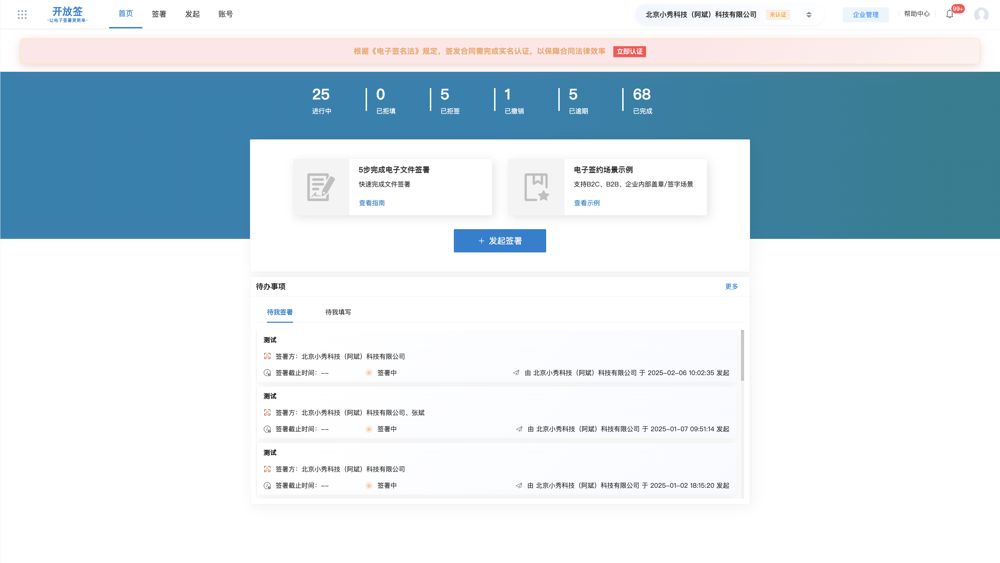
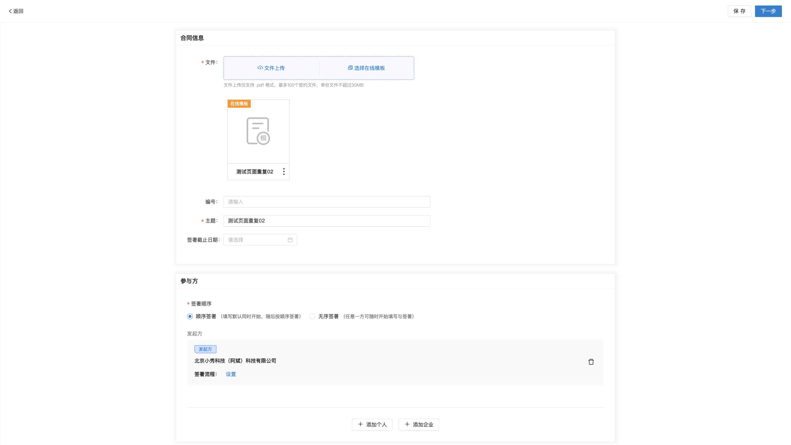
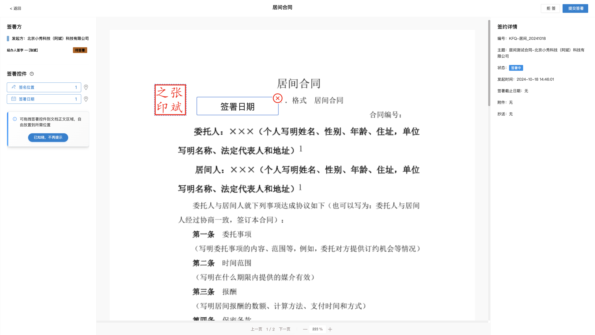
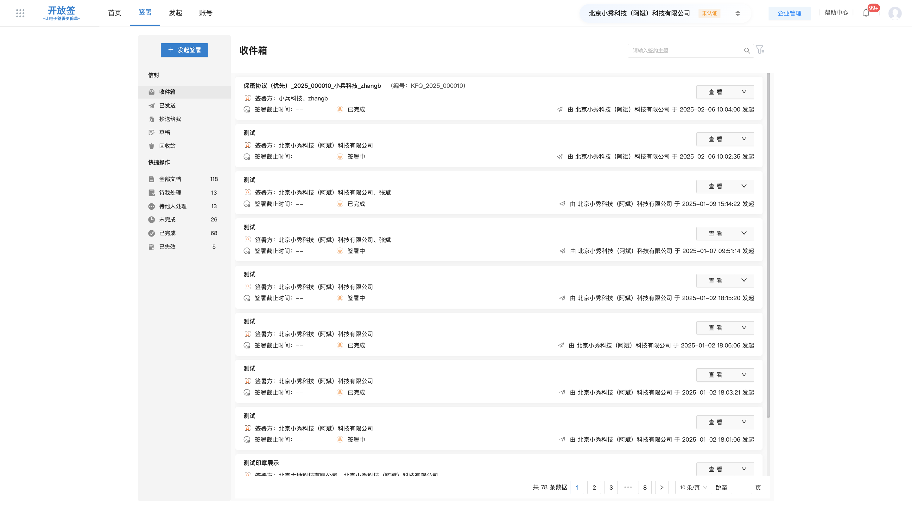
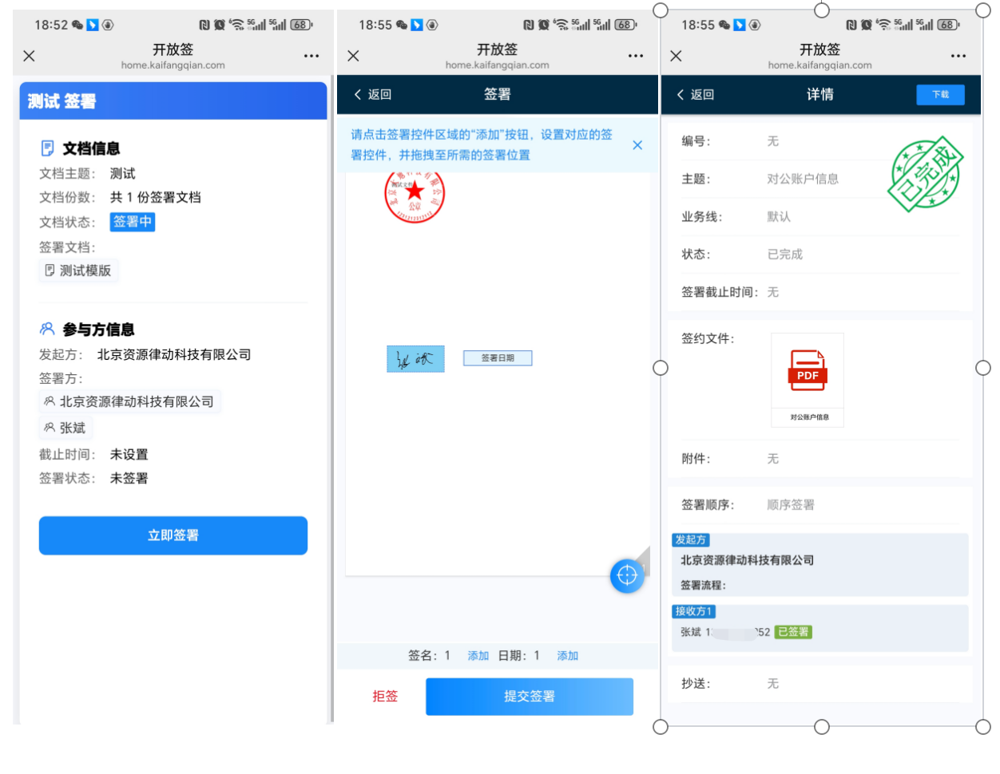
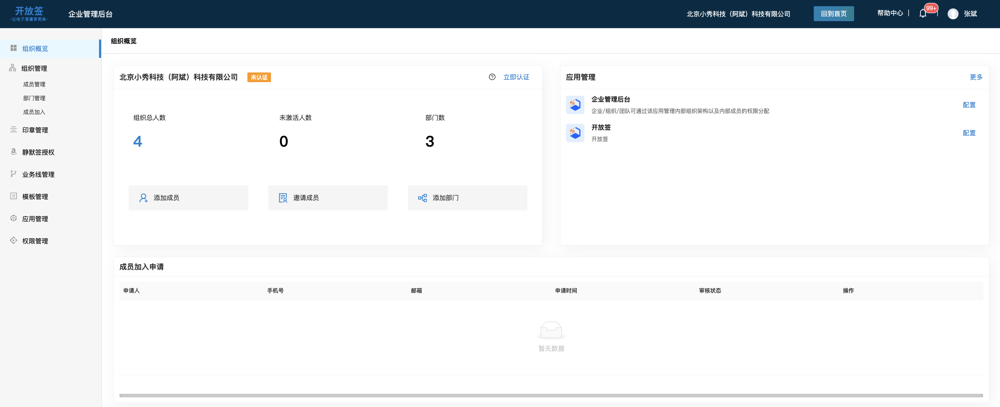
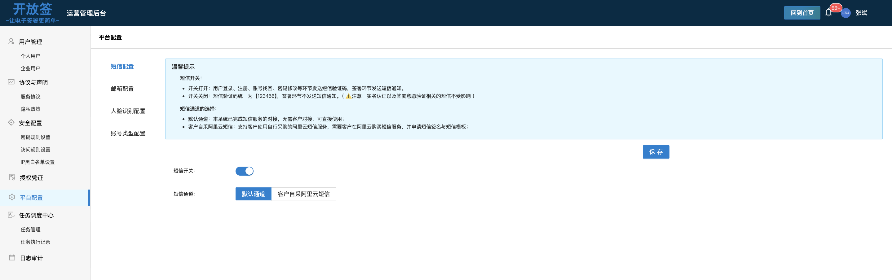

https://gitee.com/activity/2025opensource?ident=ICGZXQ  
开放签开源项目**正在参加 Gitee 2025 最受欢迎的开源软件投票活动**  
感谢各位朋友能帮我们投上宝贵一票，谢谢!  **点击链接即可投票👆**


# 开放签电子签章系统

## 项目简介
开放签是一个电子签章平台，提供合同创建、签署、管理及验证等完整解决方案。系统支持个人与企业实名认证、电子印章管理、合同模板配置、签署流程控制等功能，适用于各类需要电子签约的业务场景。

## 产品功能结构
开放签从不同的用户视角将平台拆分为3个用户端和1个api接口套件：
- **签约业务端**:个人和企业用户在业务端进行电子签约业务处理；
- **企业管理端**:企业管理员对企业组织、印章、证书及应用权限进行管理；
- **平台运营端**:平台运营方对平台内账号、证书、实名认证信息、安全配置等进行管理；
- **API接口**:供相关业务系统、办公系统等与开放签电子签章系统功能无缝对接集成，确保业务流程的高效协同。


## 核心功能
- **文件在线签发**:支持 Web、H5、API 多端签署各类文件（如电子合同、标书、货运单、证明、审批文件等），满足多种签署需求。
- **企业印章管理**:支持印章全生命周期管理（新增、编辑、停用、销毁等），支持三权分立机制：管理权、使用权、审计权。
- **企业组织及权限管理**:支持平台多租户、企业组织架构、成员、角色及权限管理。
- **业务线管理**:业务线是一种电子文件签署的业务流程，通过对业务线配置可构建电子合同、电子保单、招投标文件、电子成绩单、电子证明、金融凭证、会计凭证、电子处方等多种电子文件签署场景，具备灵活规范、操作合规、风险可控、效率提升等特点.
- **自定义签署文档模板**:提供在线模板功能，签署过程可使用模板完成多方填写和确认。
- **安全合规认证**:符合电子签名法律法规，结合国密算法加密、签名，确保签署流程可追溯、防篡改。通过公安部门实名认证锁定身份，权威 CA 机构颁发数字证书确保法律效力，全过程操作日志归档保全。

## 核心特性

- **多种签署模式**：支持单方签署、顺序签署、并行签署、批量签署和自动签署
- **完整的身份认证**：集成个人实名认证、企业认证和云盾认证
- **安全的数字签名**：基于RSA/SM2算法的数字签名技术，支持PDF数字签名
- **灵活的文档管理**：支持PDF文档处理、控件设置、签名位置计算
- **多样化存储**：支持本地存储、阿里云OSS、MinIO等多种存储方案
- **租户级隔离**：支持多租户架构，提供企业级的数据隔离
- **完善的权限控制**：基于Shiro+JWT的安全框架，支持细粒度权限控制


# 技术架构
开放签采用现代化前后端分离架构，构建了一个安全、合规、可扩展的电子签平台。整体设计兼顾技术透明性与司法可信度，支持私有化部署、多租户服务和标准化 API 接入，满足企业级应用场景需求。
架构设计遵循模块化、高内聚低耦合原则，便于二次开发、功能扩展及集成对接。
- **前端框架**:Vue 3 + Vite
- **后端语言**:Java（JDK 1.8+）
- **后端框架**:Spring Boot + Spring Security + MyBatis Plus
- **文件处理**:Apache PDFBox 实现 PDF 文档操作
- **数据库**:MySQL / PostgreSQL（支持国产数据库适配）
- **部署方式**:支持 Docker 容器化部署
- **接口规范**:RESTful API
- **日志系统**:Logback + ELK 可视化日志分析
- **权限控制**:RBAC 模型 + JWT 认证机制

## 系统架构图

## 代码结构

```
kaifangqian-base/
├── kaifangqang-parent/         # 后端项目根目录
│   ├── kaifangqian-core/       # 核心模块
│   ├── kaifangqian-system/     # 系统模块
│   ├── kaifangqian-tools/      # 工具模块
│   └── sql/                    # 数据库脚本
├── kaifangqian-web/            # 前端项目根目录
│   ├── opensign-manage/        # 管理后台
│   ├── opensign-message/       # 消息服务
│   ├── opensign-mobile/        # 移动端应用
│   ├── opensign-tenant/        # 租户管理
│   └── opensign-web/           # 签署主应用
└── README.md                   # 项目说明文档
                   
```

[开发指南请查看wiki](https://gitee.com/kaifangqian/kaifangqian-base/wikis/%E5%BC%80%E6%94%BE%E7%AD%BE%E7%94%B5%E5%AD%90%E7%AD%BE%E7%AB%A0%E7%B3%BB%E7%BB%9F%E5%BC%80%E5%8F%91%E6%8C%87%E5%8D%97)

## 本地运行
### [启动后端](./kaifangqian-parent/README.md)
### [启动前端](./kaifangqian-web/README.md)

# 功能截图







# 系统部署
## 环境要求
- **JDK**: 1.8+ (小于17)
- **Maven**: 3.x
- **MySQL**: 5.7+
- **Redis**: 任意版本
- **IDE**: IntelliJ IDEA (必须安装Lombok插件)

**推荐linux系统，服务器配置4核八G**


- 【推荐】EazyDevelop快速一键私有化部署：https://eazydevelop.eazytec-cloud.com/templates/dev-template-4fb918-1763537840?q=183of_1VmfPI_1OHgqL
- 原生部署：（下载源码，自行打包）https://docs.kaifangqian.com/docs/deploy/native
- docker部署：（下载仓库中deploy文件）https://docs.kaifangqian.com/docs/deploy/docker 
 
**部署完成后，如需使用认证的CA数字证书签署，请联系官方获取云盾服务授权码。或者自行集成第三方ca机构的数字证书服务** 

# 相关地址
- **产品门户网站**:https://www.kaifangqian.com
- **线上体验地址**:https://home.kaifangqian.com
- **产品参考文档**:https://docs.kaifangqian.com
- **接口文档**:https://docs.kaifangqian.com/docs/api/quick-start

## 加入社群
请大家帮忙点击下“star”，我们将全力以赴迭代系统功能。  
点击“star”的用户，优先审核加入官方社群。


# 许可证
本项目基于 [AGPLv3](https://www.gnu.org/licenses/agpl-3.0) 协议开源。

**重要说明**: 根据AGPLv3协议，如果您通过网络提供服务（如Web应用），必须公开修改后的完整源代码（包括衍生作品）。

# 🙏 致谢

感谢以下开源项目为本项目提供支持：

- [Spring Boot](https://spring.io/projects/spring-boot)
- [MyBatis Plus](https://baomidou.com/)
- [Apache PDFBox](https://pdfbox.apache.org/)
- [Apache Shiro](https://shiro.apache.org/)
- [Redisson](https://redisson.org/)

